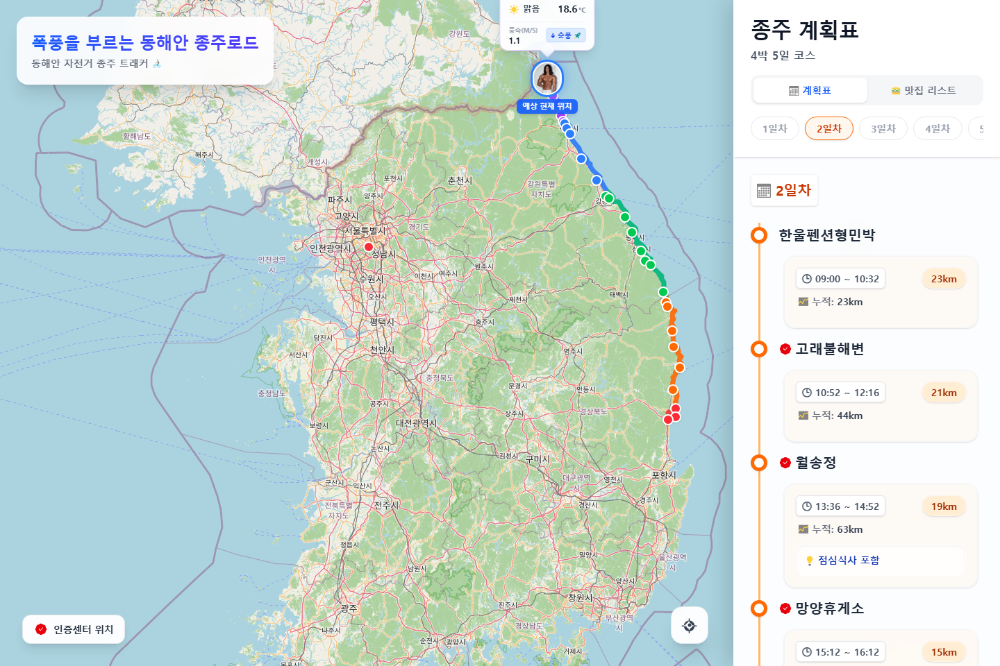
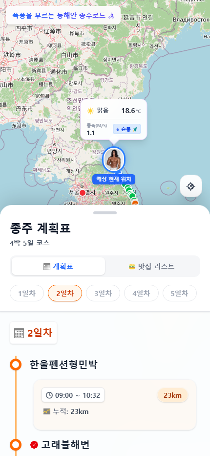
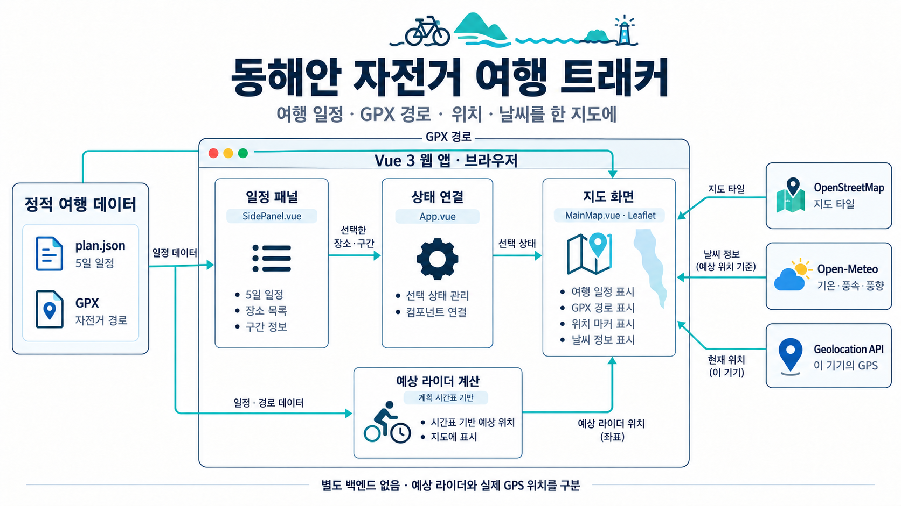

# 폭풍을 부르는 동해안 종주로드 🚴

지인들과 동해안 자전거 여행을 가려고 만든 **여행 일정·경로 지도 웹 앱**입니다. 4박 5일 계획표와 GPX 경로를 함께 보며, 날짜별 이동 구간과 주요 장소를 확인할 수 있습니다.

[앱 열기](https://jaehyeok-99.github.io/stormy-east-coast-tracker/)

## 만든 목적

여행 준비에 필요한 시간표, 이동 거리, 장소, 자전거 경로를 한 화면에서 확인할 수 있도록 구성했습니다. 계획표에서 장소나 이동 구간을 선택하면 지도가 해당 위치나 경로를 보여줍니다.

현재 여행 데이터는 영덕에서 통일전망대 방향으로 이동하는 5일 일정입니다. 특정 여행을 위해 만든 도구로, 저장된 일정은 실제 주행 완료 기록을 의미하지 않습니다.

## 주요 기능

| 기능 | 동작 |
| --- | --- |
| 날짜별 계획표 | 출발·도착 장소, 예정 시간, 구간 거리, 누적 거리와 메모 표시 |
| GPX 경로 지도 | 경북·강원 자전거길과 연결 구간을 합쳐 날짜별 색상으로 표시 |
| 장소·구간 선택 | 계획표 선택을 지도 이동·경로 강조와 연결 |
| 인증센터 표시 | 코드에 등록한 주요 인증센터를 마커로 구분 |
| 내 위치 | 권한 허용 시 현재 기기의 GPS 위치 표시·갱신 |
| 예상 라이더 | 계획 시간표와 현재 시각을 이용해 예상 위치 표시 |
| 날씨 | 예상 라이더 위치의 기온, 날씨, 풍속·풍향 표시 |
| 모바일 화면 | 하단 패널의 높이를 드래그로 조절 |

**예상 라이더는 시간표로 계산한 가상 위치이고, 내 위치는 이 기기의 GPS입니다. 동행자의 위치를 실시간 공유하는 기능은 없습니다.**

## 실행 화면

실제 배포 페이지에서 2일차 계획표를 선택한 화면입니다. 2026-10-02에 PC Chromium으로 캡처했으며, 내 GPS 위치 추적은 켜지 않았습니다. 표시되는 날씨는 캡처 시점의 API 응답입니다.

<details>
<summary>PC 화면 펼쳐보기</summary>



</details>

<details>
<summary>모바일 화면 펼쳐보기</summary>

<p align="center">
  
</p>

PC 브라우저의 430px 모바일 폭 캡처입니다. 실제 휴대전화의 GPS·백그라운드 동작을 검증한 화면은 아닙니다.

</details>

## 아키텍처



별도 백엔드 없이 브라우저에서 여행 데이터와 위치를 처리합니다. 그림의 예상 라이더 계산은 MainMap.vue 안의 로직을 역할별로 구분한 것입니다.

- SidePanel.vue가 날짜·장소·구간 선택 이벤트를 보냅니다.
- App.vue가 선택 상태를 MainMap.vue에 전달합니다.
- MainMap.vue가 GPX를 읽고 Leaflet 지도에 경로·마커를 표시합니다.
- OpenStreetMap 타일과 Open-Meteo 날씨는 외부 서비스에서 가져옵니다.
- Geolocation API로 읽은 내 위치는 지도에 표시하며, 코드에는 동행자에게 전송하는 서버 요청이 없습니다. 날씨 요청에는 예상 라이더의 좌표를 사용합니다.

## 기술과 파일 구성

Vue 3 · Vite 8 · Tailwind CSS 4 · Leaflet · Axios · TypeScript

| 파일 | 역할 |
| --- | --- |
| [src/App.vue](./src/App.vue) | 지도와 패널 연결, 선택 상태 관리 |
| [src/components/MainMap.vue](./src/components/MainMap.vue) | 지도, GPX 처리, 예상 라이더, GPS, 날씨 |
| [src/components/SidePanel.vue](./src/components/SidePanel.vue) | 계획표, 날짜 탭, 모바일 패널 |
| [src/composables/useTracker.js](./src/composables/useTracker.js) | 좌표 간 거리·GPX 누적 거리 계산 유틸리티 |
| [src/assets/plan.json](./src/assets/plan.json) | 날짜별 장소·시간·거리·메모 |
| [public/](./public/) | GPX 경로와 지도 마커 이미지 |
| [.github/workflows/deploy.yml](./.github/workflows/deploy.yml) | main 변경 시 빌드 후 GitHub Pages 배포 |

예상 라이더의 이동 위치는 일정 구간의 경과 시간 비율과 GPX 점 인덱스로 계산합니다. 누적 거리 계산 유틸리티가 있지만, 현재 예상 라이더가 거리 기준으로 등속 이동하는 구현은 아닙니다.

## 로컬 실행

Node.js 20.19+ 또는 22.12+와 npm이 필요합니다. [Vite 실행 환경 안내](https://vite.dev/guide/)

```bash
git clone https://github.com/jaehyeok-99/stormy-east-coast-tracker.git
cd stormy-east-coast-tracker
npm ci
npm run dev
```

Vite가 표시하는 주소를 엽니다. base 경로가 `/stormy-east-coast-tracker/`로 설정되어 있습니다.

```bash
npm run build
npm run preview
```

지도 타일과 날씨 조회에는 인터넷 연결이 필요합니다. 모바일 GPS 사용에는 HTTPS와 위치 권한이 필요하며, 백그라운드에서 지속 수신되는지는 기기·브라우저에 따라 달라집니다.

## 여행 데이터 변경

- 일정: plan.json의 장소 좌표, 예정 시간, 거리, 메모 수정
- 경로: public의 GPX와 MainMap.vue의 파일명·연결·잘라내기 기준 수정
- 시작일: MainMap.vue의 startDate 수정 — 현재는 **실행 연도의 5월 1일**로 고정
- 배포 경로: 저장소 이름이 달라지면 vite.config.js의 base 수정

새 경로를 넣을 때는 GPX 좌표 순서와 일정 좌표가 맞는지 확인해야 합니다. 현재 경로 처리에는 이 여행의 출발·종료 위치에 맞춘 기준값이 들어 있습니다.

## 현재 범위와 한계

- 맛집 리스트 탭은 준비 중 화면이며 식당 데이터는 없습니다.
- 순풍·역풍 표시는 풍향 구간을 간단히 분류합니다. 실제 도로의 진행 방향과 풍향을 비교하는 계산은 아닙니다.
- 계획표의 거리와 GPX 계산값은 별개 데이터입니다. 예를 들어 2일차 마지막 누적 거리는 앞 항목보다 작아 정합성 확인이 필요합니다.
- 주행 기록 저장, 동행자 위치 공유, 자동 길찾기, 오프라인 지도는 구현하지 않았습니다.
- 문서 작성 시 배포 화면의 지도·경로 표시와 날짜 탭 전환을 확인했고 JavaScript 실행 오류는 없었습니다. 로컬 빌드, 실제 GPS 주행, 모바일 백그라운드 수신을 새로 검증한 것은 아닙니다.

## 데이터·서비스 출처

- 지도: [OpenStreetMap](https://www.openstreetmap.org/copyright)
- 날씨: [Open-Meteo](https://open-meteo.com/)
- 여행 일정·경로: 저장소의 plan.json과 GPX 파일

GPX 원본의 제공처와 이용 조건은 저장소에 별도로 기록되어 있지 않습니다.
